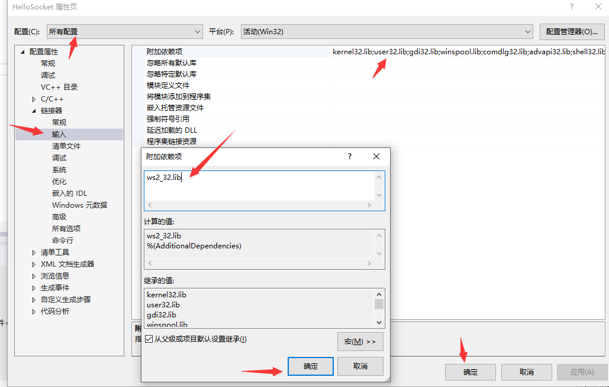

HelloSocket.cpp
=========
以此例子介绍vs中关于运行socket程序的一些配置
------

- 关于头文件冲突
	windows.h与winsock2.h存在部分宏冲突

  **解决方案** 
   定义一个关键宏  
`#define WIN32_LEAN_AND_MEAN `

- 关于链接不到相关的静态文件
  链接不到ws2_32.lib库
  
  **解决方案1** 
  pragma comment方式引入ws2_32.lib 
  `#pragma comment(lib,"ws2_32.lib")`
  
    **解决方案2** 
  项目属性进行配置 
  

部分函数的介绍
-------
- WSAStart() 
  即WSA(Windows Sockets Asynchronous，Windows异步套接字)的启动命令,**应用程序或DLL只能在一次成功的WSAStartup()调用之后才能调用进一步的Windows Sockets API函数!**
  > 补充，lp开头的变量表明是结构体指针

 